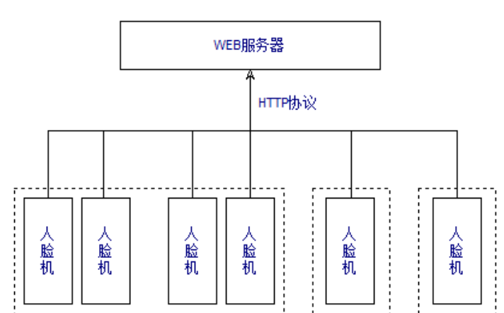
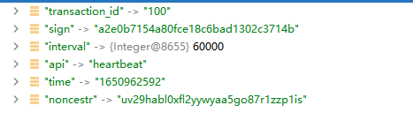

= 心跳机制设计文档
v1.0, 2022-04-14
:doctype: article
:encoding: utf-8
:lang: zh
:toc:
:numbered:
:AUTHOR: wangmaojun

## 心跳机制设计

### 数据库表

1. 设备信息表smf_device

----
CREATE TABLE `smf_device` (
  `id` int(10) unsigned NOT NULL AUTO_INCREMENT,
  `dev_id` varchar(6) COLLATE utf8mb4_unicode_ci DEFAULT NULL,
  `organization_id` int(11) DEFAULT NULL COMMENT ' 组织ID',
  `mac` varchar(500) COLLATE utf8mb4_unicode_ci DEFAULT '' COMMENT '设备的MAC地址',
  `ip` varchar(50) COLLATE utf8mb4_unicode_ci DEFAULT '',
  `fireware` varchar(255) COLLATE utf8mb4_unicode_ci DEFAULT '' COMMENT '固件版本号',
  `version` varchar(255) COLLATE utf8mb4_unicode_ci DEFAULT '' COMMENT '软件版本号',
  `model` varchar(2) COLLATE utf8mb4_unicode_ci DEFAULT '' COMMENT '机型，1考勤机，2门禁机，5消费机，6充值',
  `sub_model` varchar(20) COLLATE utf8mb4_unicode_ci DEFAULT '' COMMENT '子功能，1去向牌门禁机，2会议人脸门禁，3会议看板',
  `serialno` varchar(100) COLLATE utf8mb4_unicode_ci DEFAULT '' COMMENT '设备序列号，有的机型传出此值',
  `time` varchar(20) COLLATE utf8mb4_unicode_ci DEFAULT '' COMMENT '设备时间，unix时间毫秒',
  `customer` varchar(20) COLLATE utf8mb4_unicode_ci DEFAULT '' COMMENT '客户标识，默认为空',
  `door_state` varchar(20) COLLATE utf8mb4_unicode_ci DEFAULT '' COMMENT '门状态，0开  1关，以下同',
  `person_count` int(11) DEFAULT NULL COMMENT '当前名单数量',
  `face_count` int(11) DEFAULT NULL COMMENT '当前人脸数量',
  `total` int(11) DEFAULT NULL COMMENT '未上传的记录数量',
  `build_time` varchar(50) COLLATE utf8mb4_unicode_ci DEFAULT '' COMMENT 'APP编译时间',
  `wallet_consume_mode` varchar(10) COLLATE utf8mb4_unicode_ci DEFAULT '' COMMENT '钱包扣款模式：0先消费补贴再个人，1仅现金，2仅补贴',
  `consume_finish_voice_type` int(11) DEFAULT NULL COMMENT '//0="谢谢", 1="播报消费金额", 2="姓名+谢谢",3= "姓名+金额"',
  `settings` text COLLATE utf8mb4_unicode_ci COMMENT '  消费机设置，json格式数据',
  `reload` int(1) DEFAULT NULL COMMENT '1: 需要重载配置，0: 不需要重载配置',
  `last_heartbeat_time` datetime DEFAULT NULL COMMENT '最近一次收到设备心跳时间',
  `create_time` datetime DEFAULT NULL,
  `update_time` datetime DEFAULT NULL,
  `deleted` tinyint(4) DEFAULT '0',
  PRIMARY KEY (`id`) USING BTREE
) ENGINE=InnoDB AUTO_INCREMENT=21 DEFAULT CHARSET=utf8mb4 COLLATE=utf8mb4_unicode_ci ROW_FORMAT=DYNAMIC COMMENT='消费设备（松美人脸机）';

----

### 心跳健康检测设计思路

松美消费机设备定时主动与服务端 smface server 以 http 进行通讯，是属于被动模式，如果 smface-server 在一定时间内没收到设备发送的心跳请求，则认为设备掉线。

1. 松美消费机设备以一定时间间隔主动调取 smface server 服务接口，接口地址 /request/heartbeat, 目前默认的间隔时间是60s，这个时间间隔可以修改

2. 请求到达 smface server 服务后，接口本身处理完心跳机制相关事项，更新 smf_device表中的 last_heartbeat_time 字段，还会处理其他功能事项

3. 处理的其他事项包含： 同步设备参数修改、同步下发增加白名单用户列表、同步下发删除白名单用户列表

4. 设备参数修改

DeviceEntity 消费机实体类，对应数据库表 smf_device,其中 settings 字段就是设备设置参数

----
消费机模式： 单价、定额、时段消费
----

* 单价消费

consume_type = 0 代表定价消费
----
{
	"dev_set": [{
		"key": "title",
		"value": "智慧消费机",
		"param_id": "000000"
	}, {
		"key": "consume_type",
		"value": "0",
		"param_id": "000000"
	}, {
		"key": "qrcode_switch",
		"value2": true,
		"param_id": "000000"
	}, {
		"key": "qr_code_pass",
		"value2": true,
		"param_id": "000000"
	}, {
		"key": "admin_mend_password1",
		"value": "1111",
		"param_id": "000000"
	}, {
		"key": "fix_money",
		"value": 1200,
		"param_id": "000000"
	}]
}
----

* 定额消费

consume_type = 1
----
{
	"dev_set": [{
		"key": "title",
		"value": "智慧消费机",
		"param_id": "000000"
	}, {
		"key": "consume_type",
		"value": "1",
		"param_id": "000000"
	}, {
		"key": "qrcode_switch",
		"value2": true,
		"param_id": "000000"
	}, {
		"key": "qr_code_pass",
		"value2": true,
		"param_id": "000000"
	}, {
		"key": "admin_mend_password1",
		"value": "1111",
		"param_id": "000000"
	}, {
		"key": "fix_money",
		"value": 1000,
		"param_id": "000000"
	}]
}
----

* 时段消费

consume_type = 2

time_period 以数组的形式呈现，可以设置多个时段

----
{
	"dev_set": [{
		"key": "title",
		"value": "智慧消费机",
		"param_id": "000000"
	}, {
		"key": "consume_type",
		"value": "2",
		"param_id": "000000"
	}, {
		"key": "qrcode_switch",
		"value2": true,
		"param_id": "000000"
	}, {
		"key": "qr_code_pass",
		"value2": true,
		"param_id": "000000"
	}, {
		"key": "admin_mend_password1",
		"value": "1111",
		"param_id": "000000"
	}, {
		"key": "fix_money",
		"value": 1000,
		"param_id": "000000"
	}],
	"time_period": [{
		"id": "0",
		"start_time": "07:00:00",
		"end_time": "09:00:00",
		"use_mode": "00",
		"tmrtype": "",
		"mark": "",
		"level": "0",
		"maxcount": "1",
		"fixmoney": 500,
		"consume_type": "1",
		"param_id": "000000"
	}]
}
----

## 程序实现流程

### 书写 request/heartbeat 接口

====
 /**
     * @param data
     * @return
     */
    @RequestMapping("heartbeat")
    public JSONObject heartbeat(@RequestBody JSONObject data) {
        JSONObject jsonObject = new JSONObject();
         deviceEntity.setLastHeartbeatTime(LocalDateTime.now());
         //......
         jsonObject.put("interval", 60000);
        return jsonObject;
    }
====

### 应答设备参数

### api value

api = "heartbeat"

## 修改心跳间隔时间

在服务端应答设备回传的参数可以修改心跳时间间隔，字段 interval

----
jsonObject.put("interval", 60000);
----

## 如何判断消费机在线

1. 查看消费机，如果屏幕中央显示 “记账模式”，则表示离线，反之表示在线。

2. 查看数据库表smf_device 中的last_heartbeat_time字段值

## 权限认证

注意：如果采用spring security 或者 Oauth2, 一定要将 /request/heartbeat 进行权限放行，不然设备无法调取接口

