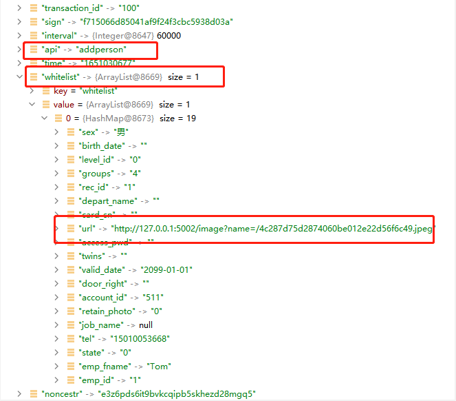

= 下发人脸到设备设计文档
v1.0, 2022-04-14
:doctype: article
:encoding: utf-8
:lang: zh
:toc:
:numbered:
:AUTHOR: wangmaojun

## 下发人脸到设备设计

1. 用户同步信息表

----
CREATE TABLE `smf_whitelist` (
  `id` int(10) unsigned NOT NULL AUTO_INCREMENT,
  `dev_id` varchar(3) COLLATE utf8mb4_unicode_ci NOT NULL,
  `account_id` int(10) DEFAULT NULL COMMENT '帐号',
  `emp_id` int(10) DEFAULT NULL COMMENT '员工ID',
  `emp_fname` varchar(50) COLLATE utf8mb4_unicode_ci DEFAULT NULL COMMENT '姓名',
  `depart_name` varchar(50) COLLATE utf8mb4_unicode_ci DEFAULT NULL COMMENT '部门',
  `job_name` varchar(50) COLLATE utf8mb4_unicode_ci DEFAULT NULL COMMENT '//职务，仅10.1寸去向牌门禁机有效',
  `tel` varchar(20) COLLATE utf8mb4_unicode_ci DEFAULT NULL COMMENT '//电话，仅10.1寸去向牌门禁机有效',
  `sex` varchar(10) COLLATE utf8mb4_unicode_ci DEFAULT NULL COMMENT '//性别，可为空字符',
  `birth_date` varchar(20) COLLATE utf8mb4_unicode_ci DEFAULT NULL COMMENT '//出生日期，可为空字符',
  `valid_date` varchar(20) COLLATE utf8mb4_unicode_ci DEFAULT NULL COMMENT '//有效日期，必填',
  `level_id` int(10) DEFAULT '0' COMMENT '//级别，整数，必须是整数，必填',
  `card_sn` varchar(20) COLLATE utf8mb4_unicode_ci DEFAULT '' COMMENT '//卡序列号，整数，没有时，用空字符，有卡号时前面不能有0',
  `door_right` varchar(255) COLLATE utf8mb4_unicode_ci DEFAULT NULL COMMENT '//门权限, 预留，没有时用空字符',
  `url` varchar(255) COLLATE utf8mb4_unicode_ci DEFAULT NULL COMMENT '//个人相片的url地址，可为空字符，表示无相片',
  `groups` bigint(20) DEFAULT '4' COMMENT '//组别为第3组，长整型，二进制时从最低位开始为1组，0表示无，1表示有，例如第3组的二进制表示0000100，转换为十进制则是4，第3组的groups为4，必填',
  `access_pwd` varchar(50) COLLATE utf8mb4_unicode_ci DEFAULT NULL COMMENT '//个人密码，整数，4位，不足补0，必填',
  `state` int(2) DEFAULT '0' COMMENT '//整数，状态：0正常  2挂失（只有刷卡时才会判断，人脸不判断，另离线时才判断，在线由平台判断），为整数，不能非整数，必填',
  `twins` varchar(255) COLLATE utf8mb4_unicode_ci DEFAULT '' COMMENT '//固定为空，必填',
  `retain_photo` int(10) DEFAULT '0' COMMENT '//整数，下载个人相片处理方式， 仅url为空时才有效， = 0默认删除相片 、 1保留相片还要识别，必填，无相片时统一此值用0，当url有值时按url的值处理',
  `result_code` int(10) DEFAULT NULL COMMENT '设备名单处理结果\n400成功\n401没有个人相片\n402没有检测到人脸\n403人脸姿势不正确\n404检测图片异常\n405图片超过4M错误\n406名单超出数量\n407base64转图片出错\n408文件写入失败\n409bitmap转byte数组出错\n410人脸已存在\n411人脸模糊\n412 未定义\n413脸部特征被遮挡\n414人脸图片拍照环境偏暗\n415人脸图片存在多张人脸\n416人脸尺寸过小\n417人脸在边缘位置\n418人脸相似大于3个\n419右脸过亮\n420右脸过暗\n421左脸过亮\n422未定义\n423左脸过暗\n424下巴和嘴巴过亮\n425下巴和嘴巴过暗\n',
  `like_id` varchar(255) COLLATE utf8mb4_unicode_ci DEFAULT NULL COMMENT '当返回人脸已存在时，这里显示已存在的其它工号，分号隔开',
  `status` int(1) NOT NULL DEFAULT '0' COMMENT '同步状态，0: 未开始 1: 已完成 2: 进行中',
  `action` int(1) NOT NULL DEFAULT '0' COMMENT '行为 0:添加 2:删除 4:清空消费机名单',
  `create_time` datetime DEFAULT NULL,
  `update_time` datetime DEFAULT NULL,
  PRIMARY KEY (`id`) USING BTREE
) ENGINE=InnoDB AUTO_INCREMENT=1232 DEFAULT CHARSET=utf8mb4 COLLATE=utf8mb4_unicode_ci ROW_FORMAT=DYNAMIC COMMENT='松美人脸机名单';
----

### 下发人脸到设备设计思路

在【下发用户白名单到设备的设计文档】基础上进行如下逻辑处理

1. 数据库表名 smf_whitelist, 字段url对应人脸图片地址，地址一定是能通过http或https访问的
2. 在回传的whitelist集合中，给每一个记录的url字段赋值人脸图片地址

[TIPS]
====
whitelist   集合中每个实体加入url字段
====

3. 设备收到whitelist用户白名单列表，拿到url，发送请求 /image 访问url并缓存在本地

## 程序实现流程

### request/heartbeat

====
 logger.warn("hearbeat add whitelist start ==========================: ");
        JSONObject results = new JSONObject();
        List<WhitelistEntity> whitelistEntityList = queryBySendDeviceId(devId);
        if (CollectionUtils.isEmpty(whitelistEntityList)) {
            return null;
        }

        logger.warn("hearbeat add whitelist list ==========================: " + JSON.toJSONString(whitelistEntityList));

        String api = GlobalConstant.SM_ADD_PERSON;
        String time = ServerUtils.getTimestampSeconds().toString();
        String noncestr = ServerUtils.getRandomString(32).toLowerCase();
        String base = time + noncestr + GlobalConstant.CARD_PWD;
        results.put("api", api);
        results.put("time", time);
        results.put("noncestr", noncestr);
        results.put("interval", GlobalConstant.interval);
        results.put("sign", ServerUtils.computeMd5Sign(base));
        results.put("transaction_id", transactionId);
        List<HashMap<Object, Object>> whitelistMaps = new ArrayList<>();
        int size = whitelistEntityList.size();
        for (int i = 0; i < size; i++) {
            HashMap<Object, Object> whitelistMap = new HashMap<>();
            WhitelistEntity whitelistEntity = whitelistEntityList.get(i);
            whitelistMap.put("rec_id", whitelistEntity.getId().toString());
            whitelistMap.put("account_id", whitelistEntity.getAccountId().toString());
            whitelistMap.put("emp_id", whitelistEntity.getEmpId().toString());
            whitelistMap.put("emp_fname", whitelistEntity.getEmpFname());
            whitelistMap.put("depart_name", whitelistEntity.getDepartName());
            whitelistMap.put("job_name", whitelistEntity.getJobName());
            whitelistMap.put("tel", whitelistEntity.getTel());
            whitelistMap.put("sex", whitelistEntity.getSex());
            whitelistMap.put("birth_date", whitelistEntity.getBirthDate());
            whitelistMap.put("valid_date", whitelistEntity.getValidDate());
            whitelistMap.put("level_id", whitelistEntity.getLevelId().toString());
            whitelistMap.put("card_sn", whitelistEntity.getCardSn());
            whitelistMap.put("door_right", whitelistEntity.getDoorRight());
            whitelistMap.put("url", whitelistEntity.getUrl());
            whitelistMap.put("groups", whitelistEntity.getGroups().toString());
            whitelistMap.put("access_pwd", whitelistEntity.getAccessPwd());
            whitelistMap.put("state", whitelistEntity.getState().toString());
            whitelistMap.put("twins", whitelistEntity.getTwins());
            whitelistMap.put("retain_photo", whitelistEntity.getRetainPhoto().toString());
            whitelistMaps.add(whitelistMap);
        }
        results.put("whitelist", whitelistMaps);
        logger.warn("hearbeat add whitelist results ==========================: " + JSON.toJSONString(results));
        logger.warn("hearbeat add whitelist success ==========================");
        return results;
====

### /image

设备访问人脸图片url

----
@GetMapping("")
    @ResponseBody
    public void getImage(
            HttpServletRequest request,
            HttpServletResponse response,
            @RequestParam(value="name", defaultValue = "") String name
    ) {
        try {
            String url= GlobalConstant.API_HOST + name;
            File file = new File(url);
            String l=request.getRealPath("/")+"/"+url;
            String filename = file.getName();
            logger.warn("filename = " + filename);
            String[] split = filename.split("\\.");
            String ext = split[1];
            InputStream fis = new BufferedInputStream(new FileInputStream(file));
            byte[] buffer = new byte[fis.available()];
            fis.read(buffer);
            fis.close();
            response.reset();
            // 设置response的Header
            response.addHeader("Content-Length", "" + file.length());
            System.out.println("image/split[1] = " + "image/" + split[1]);
            response.setContentType("image/" + ext);

            OutputStream toClient = new BufferedOutputStream(response.getOutputStream());
            toClient.write(buffer);
            toClient.flush();
            toClient.close();
        } catch (IOException ex) {
            ex.printStackTrace();
        }
    }

----

### 应答设备参数

### api value

api = "heartbeat"

## 修改心跳间隔时间

在服务端应答设备回传的参数可以修改心跳时间间隔，字段 interval

----
jsonObject.put("interval", 60000);
----

## 用户下发延迟时间

1. 受到心跳间隔时间interval影响
2. 受到设备主动调取/request/addperson 的影响
3. 如果某用户点击同步后发现没同步成功，无需再点击同步按钮，都是徒劳的

## 权限认证

注意：如果采用spring security 或者 Oauth2, 一定要将 /request/heartbeat, /image 进行权限放行，不然设备无法调取接口