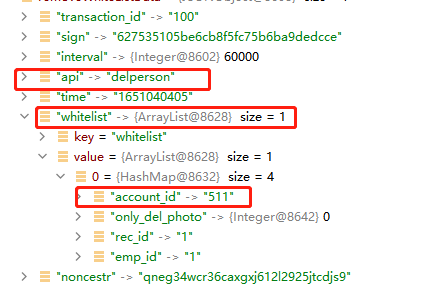

= 移除用户白名单设计文档
v1.0, 2022-04-18
:doctype: article
:encoding: utf-8
:lang: zh
:toc:
:numbered:
:AUTHOR: wangmaojun

## 移除用户白名单设计

### 数据库表

1. 用户同步信息表

----
CREATE TABLE `smf_whitelist` (
  `id` int(10) unsigned NOT NULL AUTO_INCREMENT,
  `dev_id` varchar(3) COLLATE utf8mb4_unicode_ci NOT NULL,
  `account_id` int(10) DEFAULT NULL COMMENT '帐号',
  `emp_id` int(10) DEFAULT NULL COMMENT '员工ID',
  `emp_fname` varchar(50) COLLATE utf8mb4_unicode_ci DEFAULT NULL COMMENT '姓名',
  `depart_name` varchar(50) COLLATE utf8mb4_unicode_ci DEFAULT NULL COMMENT '部门',
  `job_name` varchar(50) COLLATE utf8mb4_unicode_ci DEFAULT NULL COMMENT '//职务，仅10.1寸去向牌门禁机有效',
  `tel` varchar(20) COLLATE utf8mb4_unicode_ci DEFAULT NULL COMMENT '//电话，仅10.1寸去向牌门禁机有效',
  `sex` varchar(10) COLLATE utf8mb4_unicode_ci DEFAULT NULL COMMENT '//性别，可为空字符',
  `birth_date` varchar(20) COLLATE utf8mb4_unicode_ci DEFAULT NULL COMMENT '//出生日期，可为空字符',
  `valid_date` varchar(20) COLLATE utf8mb4_unicode_ci DEFAULT NULL COMMENT '//有效日期，必填',
  `level_id` int(10) DEFAULT '0' COMMENT '//级别，整数，必须是整数，必填',
  `card_sn` varchar(20) COLLATE utf8mb4_unicode_ci DEFAULT '' COMMENT '//卡序列号，整数，没有时，用空字符，有卡号时前面不能有0',
  `door_right` varchar(255) COLLATE utf8mb4_unicode_ci DEFAULT NULL COMMENT '//门权限, 预留，没有时用空字符',
  `url` varchar(255) COLLATE utf8mb4_unicode_ci DEFAULT NULL COMMENT '//个人相片的url地址，可为空字符，表示无相片',
  `groups` bigint(20) DEFAULT '4' COMMENT '//组别为第3组，长整型，二进制时从最低位开始为1组，0表示无，1表示有，例如第3组的二进制表示0000100，转换为十进制则是4，第3组的groups为4，必填',
  `access_pwd` varchar(50) COLLATE utf8mb4_unicode_ci DEFAULT NULL COMMENT '//个人密码，整数，4位，不足补0，必填',
  `state` int(2) DEFAULT '0' COMMENT '//整数，状态：0正常  2挂失（只有刷卡时才会判断，人脸不判断，另离线时才判断，在线由平台判断），为整数，不能非整数，必填',
  `twins` varchar(255) COLLATE utf8mb4_unicode_ci DEFAULT '' COMMENT '//固定为空，必填',
  `retain_photo` int(10) DEFAULT '0' COMMENT '//整数，下载个人相片处理方式， 仅url为空时才有效， = 0默认删除相片 、 1保留相片还要识别，必填，无相片时统一此值用0，当url有值时按url的值处理',
  `result_code` int(10) DEFAULT NULL COMMENT '设备名单处理结果\n400成功\n401没有个人相片\n402没有检测到人脸\n403人脸姿势不正确\n404检测图片异常\n405图片超过4M错误\n406名单超出数量\n407base64转图片出错\n408文件写入失败\n409bitmap转byte数组出错\n410人脸已存在\n411人脸模糊\n412 未定义\n413脸部特征被遮挡\n414人脸图片拍照环境偏暗\n415人脸图片存在多张人脸\n416人脸尺寸过小\n417人脸在边缘位置\n418人脸相似大于3个\n419右脸过亮\n420右脸过暗\n421左脸过亮\n422未定义\n423左脸过暗\n424下巴和嘴巴过亮\n425下巴和嘴巴过暗\n',
  `like_id` varchar(255) COLLATE utf8mb4_unicode_ci DEFAULT NULL COMMENT '当返回人脸已存在时，这里显示已存在的其它工号，分号隔开',
  `status` int(1) NOT NULL DEFAULT '0' COMMENT '同步状态，0: 未开始 1: 已完成 2: 进行中',
  `action` int(1) NOT NULL DEFAULT '0' COMMENT '行为 0:添加 2:删除 4:清空消费机名单',
  `create_time` datetime DEFAULT NULL,
  `update_time` datetime DEFAULT NULL,
  PRIMARY KEY (`id`) USING BTREE
) ENGINE=InnoDB AUTO_INCREMENT=1232 DEFAULT CHARSET=utf8mb4 COLLATE=utf8mb4_unicode_ci ROW_FORMAT=DYNAMIC COMMENT='松美人脸机名单';
----

### 移除用户白名单设计思路

1. 组织后台管理系统点击删除用户

2. 在 smf_whitelist 表中新增一条需要删除的用户白名单记录，重点字段 status = 0 && action =2

3. 在设备 和 smface server heartbeat 心跳交互的过程中，也就是当设备发送请求 /request/heartbeat 到 smface-server,
我们会去数据库表 smf_whitelist 查询是否有待移除的用户，查询条件是status = 0 && action =2, 查询得到待移除用户白名单 whitelist

4. 请求/request/heartbeat 处理完毕后，将白名单 whitelist 返回给设备

5. 设备将本次待移除whitelist白名单列表处理完毕后，调取 /request/addperson 接口， 目的是告诉smface-server 上一次心跳下发的的待移除用户whitelist是否同步成功，在smface-server
对其进行标定，主要是标定smf-whitelist  字段status、result_code

[TIP]
====
 status: 0 表示未同步， 1表示已同步
 action: 0:添加 2:删除 4:清空消费机名单
====

6. 在返回结果集中加入

----
key         value
whitelist   白名单集合
----

7. 设备进行本地处理，移除相应白名单

8. 接着设备调取 request/delperson接口， 告知 smface-server 上次待移除的用户白名单情况，result_code = 400表示某个白名单用户移除成功

## 程序实现流程

### request/heartbeat

----
logger.warn("hearbeat remove whitelist start ==========================: ");
JSONObject results = new JSONObject();

        List<WhitelistEntity> removeList = queryByRemoveDeviceId(devId);
        if (removeList == null) return null;
        if (removeList.size() == 0) return null;

        logger.warn("hearbeat remove whitelist list ==========================: " + JSON.toJSONString(removeList));

        String api = "delperson";
        String time = ServerUtils.getTimestampSeconds().toString();
        String noncestr = ServerUtils.getRandomString(32).toLowerCase();
        String base = time + noncestr + GlobalConstant.CARD_PWD;
        results.put("api", api);
        results.put("time", time);
        results.put("noncestr", noncestr);
        results.put("interval", GlobalConstant.interval);
        results.put("sign", ServerUtils.computeMd5Sign(base));
        results.put("transaction_id", transactionId);
        ArrayList whitelists = new ArrayList<>();
        int size = removeList.size();
        for (int i = 0; i < size; i++) {
            WhitelistEntity whitelistEntity = removeList.get(i);
            HashMap<Object, Object> whitelist = new HashMap<>();
            whitelist.put("rec_id", whitelistEntity.getId().toString());
            whitelist.put("account_id", whitelistEntity.getAccountId().toString());
            whitelist.put("emp_id", whitelistEntity.getEmpId().toString());
            whitelist.put("only_del_photo", 0);
            whitelists.add(whitelist);

        }
        results.put("whitelist", whitelists);
        logger.warn("hearbeat remove whitelist results ==========================: " + JSON.toJSONString(results));
        logger.warn("hearbeat remove whitelist success ==========================");
        return results;
----

### request/delperson

主要是标定白名单中的哪些用户白名单删除成功

----
@PostMapping("delperson")
    public JSONObject delperson(@RequestBody JSONObject data) {
        try {
            logger.warn("松美消费机 iorg-smface delperson start ============================");
            String devId = data.getString("dev_id");
            String transactionId = data.getString("transaction_id");
            JSONArray whitelists = data.getJSONArray("whitelist");
            List<JSONObject> list = whitelists.toJavaList(JSONObject.class);
            for (int i = 0; i < list.size(); i++) {
                JSONObject item = list.get(i);
                Integer resultCode = Integer.parseInt(item.getString("result_code"), 10);
                Integer id = Integer.parseInt(item.getString("rec_id"), 10);
                WhitelistEntity whitelist = whiteListService.queryByRemoveId(id);
                if (whitelist == null) continue;
                whitelist.setResultCode(resultCode);
                whitelist.setStatus(2);
                whitelist.setAction(2);
                whiteListService.updateRemoveWhiteById(whitelist);
            }
            JSONObject result = whiteListService.removeWhiteList(devId, transactionId);
            // add person
            whiteListService.addSendPerson();
            return result;
        } catch (Exception e) {
            logger.error("delperson: " + e.getMessage());
            return null;
        }
    }
----

### 应答设备参数

### api value

api = "heartbeat"

## 修改心跳间隔时间

在服务端应答设备回传的参数可以修改心跳时间间隔，字段 interval

----
jsonObject.put("interval", 60000);
----

## 如何判断用户删除成功

1. 从程序角度来讲， 调取request/delperson 传送过来的参数中，每一个白名单用户都对应一个result_code 值，400表示成功，其他的表示失败
2. 从消费机进入，点击人脸录入模块，如果不存在同步的用户名称，则表示成功

## 用户移除延迟时间

1. 受到心跳间隔时间interval影响
2. 受到设备主动调取/request/delperson 的影响

## 权限认证

注意：如果采用spring security 或者 Oauth2, 一定要将 /request/heartbeat, /request/delperson 进行权限放行，不然设备无法调取接口